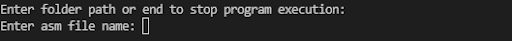

# VM-Translator

This translator takes *.vm files and creates an *.asm file with the assembly commands for a hack computer, this translator was made for the course nand to tetris.

If you want to translate vm files, you need to give the path were the files are, then you give the name to the assembly file. 
